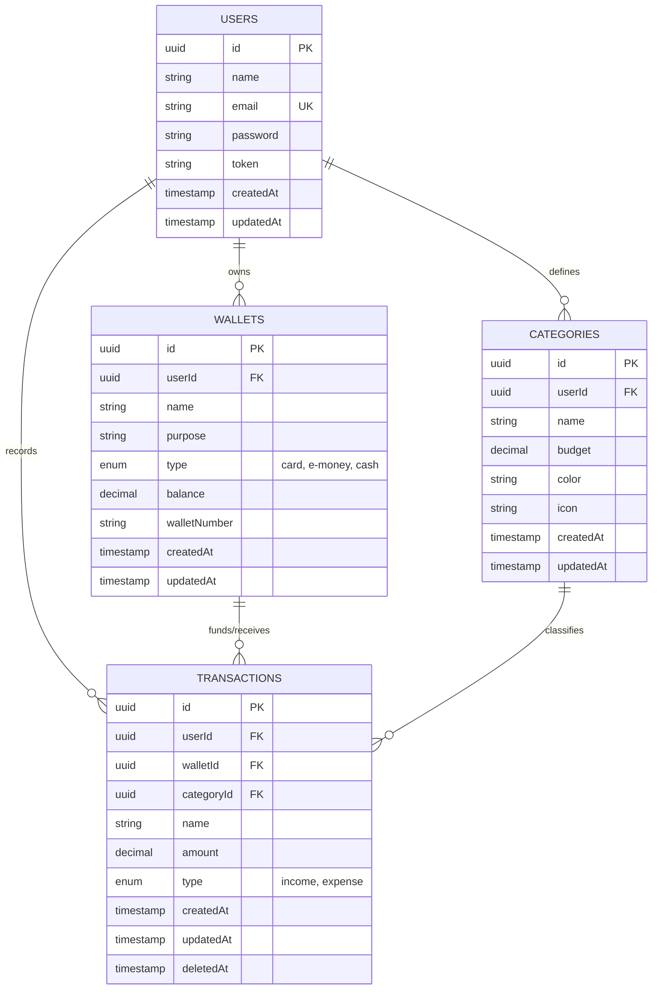

# Personal Finance Tracker API — Specification & Rebuilding Blueprint

> **Purpose:** This document is an exhaustive, framework-agnostic technical specification of the Personal Finance Tracker API. It is designed to allow any engineering team to reimplement the entire system using any modern web backend framework (e.g., NestJS, Go/Gin/Fiber, Python/FastAPI, ASP.NET Core, Java/Spring Boot, Laravel, Elixir/Phoenix, etc.) without losing any business logic, data integrity, or client compatibility.

---

## Table of Contents
1. [System Architecture & Overview](#1-system-architecture--overview)
2. [Environment Configuration](#2-environment-configuration)
3. [Database Architecture & Data Models](#3-database-architecture--data-models)
   - [Entity Relationship Diagram](#entity-relationship-diagram)
   - [Data Dictionaries](#data-dictionaries)
   - [Precision & Soft-Delete Semantics](#precision--soft-delete-semantics)
4. [Authentication & Authorization](#4-authentication--authorization)
   - [JWT Payload & Flow](#jwt-payload--flow)
   - [Session Invalidation & Single-Device Login](#session-invalidation--single-device-login)
5. [Complete API Endpoints Specification](#5-complete-api-endpoints-specification)
   - [Authentication & User Management](#authentication--user-management)
   - [Wallet Management](#wallet-management)
   - [Category Management](#category-management)
   - [Transaction Management](#transaction-management)
   - [Receipt AI Extraction Engine](#receipt-ai-extraction-engine)
   - [Spending Analysis Engine](#spending-analysis-engine)
6. [Core Business Logic & State Machines](#6-core-business-logic--state-machines)
   - [Automated Balance Synchronization](#automated-balance-synchronization)
   - [Analytics Date Calculations & MoM Formula](#analytics-date-calculations--mom-formula)
   - [AI Prompting & Structured Extraction](#ai-prompting--structured-extraction)
7. [Identified Quirks, Legacy Bugs & Recommendations](#7-identified-quirks-legacy-bugs--recommendations)
8. [Framework Migration & Verification Checklist](#8-framework-migration--verification-checklist)

---

## 1. System Architecture & Overview

The Personal Finance Tracker API is a RESTful backend service built to power mobile (primarily Android) and web personal financial management clients. 

### Key Capabilities
- **Identity & Security:** Token-based JWT authentication with single-session enforcement and bcrypt password hashing.
- **Multi-Account / Multi-Wallet Tracking:** Support for cards, e-wallets, and cash accounts.
- **Budgeting & Categorization:** Custom categories per user with color codes, icons, and monthly spending budget targets.
- **Double-Entry Balance Adjustments:** Automatic wallet balance updates triggered by income and expense transactions.
- **Auditability / Paranoid Deletions:** Soft-deletion (`paranoid`) on financial transactions to prevent accidental permanent data loss.
- **AI-Powered OCR / Receipt Extraction:** Local LLM integration (via Ollama and `llama3.2:3b`) to convert raw scanned receipt text into structured merchant, price, and line items.
- **Analytics & Trends:** Real-time spending breakdowns against budgets, custom date filtering, and 6-month historical Month-over-Month (MoM) trend calculations.

---

## 2. Environment Configuration

The following environment variables are required by the service:

| Variable | Type | Default | Description | Example |
| :--- | :--- | :--- | :--- | :--- |
| `APP_PORT` | Integer | `3000` | Port on which the HTTP server listens | `3000` |
| `DB_HOST` | String | `localhost` | Hostname or IP of the MySQL database | `127.0.0.1` |
| `DB_PORT` | Integer | `3306` | Port of the MySQL database | `3306` |
| `DB_NAME` | String | *Required* | Name of the database schema | `fintrack_db` |
| `DB_USER` | String | *Required* | Database user | `fintrack_user` |
| `DB_PASS` | String | *Required* | Database password | `secret_password` |
| `JWT_SECRET`| String | *Required* | Symmetric key used to sign and verify JWTs | `super-secret-jwt-key` |
| `OLLAMA_HOST` | String | `http://localhost:11434` | Endpoint for Ollama LLM service *(hardcoded in current code, recommended to make configurable)* | `http://127.0.0.1:11434` |
| `OLLAMA_MODEL` | String | `llama3.2:3b` | LLM model identifier for receipt extraction | `llama3.2:3b` |

---

## 3. Database Architecture & Data Models

### Entity Relationship Diagram



---

### Data Dictionaries

#### 1. `users` Table
Stores registered accounts and active tokens.

| Column | Type | Constraints | Default | Notes |
| :--- | :--- | :--- | :--- | :--- |
| `id` | UUID (v4) | `PRIMARY KEY` | Auto UUID v4 | Unique identifier |
| `name` | VARCHAR(255) | `NOT NULL` | None | User's display name or username |
| `email` | VARCHAR(255) | `NOT NULL, UNIQUE` | None | Login/contact email |
| `password` | VARCHAR(255) | `NOT NULL` | None | Bcrypt hashed password (10 salt rounds) |
| `token` | VARCHAR(512) | `NULLABLE` | `NULL` | Stores latest JWT for single-device verification |
| `createdAt` | TIMESTAMP | `NOT NULL` | CURRENT_TIMESTAMP | Record creation timestamp |
| `updatedAt` | TIMESTAMP | `NOT NULL` | CURRENT_TIMESTAMP | Record last update timestamp |

---

#### 2. `wallets` Table
Represents accounts, physical cash reserves, or cards.

| Column | Type | Constraints | Default | Notes |
| :--- | :--- | :--- | :--- | :--- |
| `id` | UUID (v4) | `PRIMARY KEY` | Auto UUID v4 | Unique identifier |
| `userId` | UUID (v4) | `NOT NULL, FK -> users(id)` | None | Owner of the wallet |
| `name` | VARCHAR(255) | `NOT NULL` | None | e.g., "BCA Primary", "Pocket Cash" |
| `purpose` | VARCHAR(255) | `NOT NULL` | None | e.g., "Daily Spending", "Savings" |
| `type` | ENUM | `NOT NULL` | None | Allowed values: `'card'`, `'e-money'`, `'cash'` |
| `balance` | DECIMAL(15, 2) | `NOT NULL` | `0.00` | Current available funds *(Note: Legacy code used FLOAT, recommend DECIMAL(15,2))* |
| `walletNumber` | VARCHAR(255) | `NULLABLE` | `NULL` | Card number, account number, or phone number |
| `createdAt` | TIMESTAMP | `NOT NULL` | CURRENT_TIMESTAMP | Creation timestamp |
| `updatedAt` | TIMESTAMP | `NOT NULL` | CURRENT_TIMESTAMP | Last update timestamp |

---

#### 3. `categories` Table
User-defined transaction categories with budgeting thresholds.

| Column | Type | Constraints | Default | Notes |
| :--- | :--- | :--- | :--- | :--- |
| `id` | UUID (v4) | `PRIMARY KEY` | Auto UUID v4 | Unique identifier |
| `userId` | UUID (v4) | `NOT NULL, FK -> users(id)` | None | Owner of the category |
| `name` | VARCHAR(255) | `NOT NULL` | None | e.g., "Food & Beverage", "Utilities" |
| `budget` | DECIMAL(15, 2) | `NULLABLE` | `0.00` | Target spending limit per month |
| `color` | VARCHAR(32) | `NULLABLE` | `"#3B82F6"` | Hex color code for UI charts/badges |
| `icon` | VARCHAR(64) | `NULLABLE` | `"folder"` | Icon identifier (e.g. Material/FontAwesome name) |
| `createdAt` | TIMESTAMP | `NOT NULL` | CURRENT_TIMESTAMP | Creation timestamp |
| `updatedAt` | TIMESTAMP | `NOT NULL` | CURRENT_TIMESTAMP | Last update timestamp |

---

#### 4. `transactions` Table
Records financial movement. Configured with **paranoid soft delete**.

| Column | Type | Constraints | Default | Notes |
| :--- | :--- | :--- | :--- | :--- |
| `id` | UUID (v4) | `PRIMARY KEY` | Auto UUID v4 | Unique identifier |
| `userId` | UUID (v4) | `NOT NULL, FK -> users(id)` | None | Transaction owner |
| `walletId` | UUID (v4) | `NOT NULL, FK -> wallets(id)` | None | Wallet debited or credited |
| `categoryId`| UUID (v4) | `NOT NULL, FK -> categories(id)` | None | Category grouping |
| `name` | VARCHAR(255) | `NOT NULL` | None | Title/merchant/description |
| `amount` | DECIMAL(15, 2) | `NOT NULL` | None | Absolute positive numeric value |
| `type` | ENUM | `NOT NULL` | None | Allowed values: `'income'`, `'expense'` |
| `createdAt` | TIMESTAMP | `NOT NULL` | CURRENT_TIMESTAMP | Effective transaction date *(can be set manually on creation)* |
| `updatedAt` | TIMESTAMP | `NOT NULL` | CURRENT_TIMESTAMP | Last modified timestamp |
| `deletedAt` | TIMESTAMP | `NULLABLE` | `NULL` | Soft delete timestamp (`paranoid: true`) |

---

### Precision & Soft-Delete Semantics

1. **Monetary Precision:**
   - In the legacy Sequelize implementation:
     - `Category.budget` was defined as `DECIMAL` (retrieved as float via getter).
     - `Wallet.balance` was defined as `FLOAT`.
     - `Transaction.amount` was defined as `DECIMAL` (retrieved as float via getter).
   - **Recommendation for Rebuilding:** All monetary fields (`balance`, `budget`, `amount`) MUST be modeled as `DECIMAL(15, 2)` or integer cents in SQL to avoid binary floating-point rounding errors.
2. **Soft Deletions:**
   - Transactions use soft delete (`paranoid: true`).
   - Querying transactions default to `WHERE deletedAt IS NULL`.
   - Restoring or hard-deleting requires explicit repository flags.

---

## 4. Authentication & Authorization

### JWT Payload & Flow

Authentication is stateless via JSON Web Tokens signed with HMAC-SHA256 (`HS256`).

- **Signature:** Standard JWT signed with `JWT_SECRET`.
- **Payload in Current Code:**
  ```json
  {
    "name": "Sendiko"
  }
  ```
  > **Rebuilding Recommendation:** The payload should be enhanced to include user ID and email:
  > ```json
  > {
  >   "sub": "6ac6b327-47c0-4e8a-adbb-4c1b075f162c",
  >   "name": "Sendiko",
  >   "email": "user@example.com",
  >   "iat": 1740000000,
  >   "exp": 1742592000
  > }
  > ```
- **Client Transmission:** Clients send the token in the HTTP `Authorization` header:
  ```http
  Authorization: Bearer <token>
  ```

---

### Session Invalidation & Single-Device Login

The legacy system enforces a single active session per user through a database column:
1. When a user logs in via `POST /login`, a new JWT is created and written to `users.token`.
2. On every protected request, the authentication middleware checks:
   - Does `Authorization: Bearer <token>` exist? (If not, returns `401 Unauthorized`).
   - Does a user record exist with `token == <request_token>`? (If not, returns `401` with message `"Your account has logged in from another device."`).
   - Is the JWT signature valid and not expired? (If not, returns `401 Unauthorized`).
3. If valid, the user identity is attached to the request context.

---

## 5. Complete API Endpoints Specification

All endpoints return JSON responses. A standard response wrapper is utilized across controllers:
```json
{
  "status": 200,
  "message": "Human-readable message",
  "data": { ... } // Or entity-specific key like "user", "wallets", "transactions"
}
```

---

### Authentication & User Management

#### 1. User Registration
Registers a new user account.

- **Route:** `POST /register`
- **Auth:** Public
- **Headers:** `Content-Type: application/json`
- **Request Body:**
  ```json
  {
    "name": "Sendiko",
    "email": "user@example.com",
    "password": "SecurePassword123"
  }
  ```
  | Field | Type | Required | Description |
  | :--- | :--- | :--- | :--- |
  | `name` | string | Yes | Display name |
  | `email` | string | Yes | Unique valid email address |
  | `password` | string | Yes | Plaintext password (will be hashed with bcrypt) |

- **Success Response (201 Created):**
  ```json
  {
    "status": 201,
    "message": "User registered successfully.",
    "user": {
      "id": "c1f7a1f5-19e0-4786-9481-807d9b73f8a4",
      "name": "Sendiko",
      "email": "user@example.com",
      "createdAt": "2026-09-28T02:40:00.000Z",
      "updatedAt": "2026-09-28T02:40:00.000Z"
    }
  }
  ```
- **Error Responses:**
  - `400 Bad Request` (Email missing):
    ```json
    { "status": 400, "message": "Email is required." }
    ```
  - `400 Bad Request` (Duplicate email):
    ```json
    { "status": 400, "message": "Email is already registered." }
    ```
  - `500 Internal Server Error`:
    ```json
    { "status": 500, "message": "Server error.", "error": "Detailed error string" }
    ```

---

#### 2. User Login
Authenticates credentials and returns a session JWT.

- **Route:** `POST /login`
- **Auth:** Public
- **Headers:** `Content-Type: application/json`
- **Request Body:**
  ```json
  {
    "name": "Sendiko",
    "password": "SecurePassword123"
  }
  ```
  *(Note: See [Section 7](#7-identified-quirks-legacy-bugs--recommendations) regarding email-based login).*
- **Success Response (200 OK):**
  ```json
  {
    "status": 200,
    "message": "User logged in successfully.",
    "user": {
      "id": "c1f7a1f5-19e0-4786-9481-807d9b73f8a4",
      "name": "Sendiko",
      "email": "user@example.com",
      "token": "eyJhbGciOiJIUzI1NiIsInR5cCI6IkpXVCJ9...",
      "createdAt": "2026-09-28T02:40:00.000Z",
      "updatedAt": "2026-09-28T02:45:00.000Z"
    }
  }
  ```
- **Error Responses:**
  - `404 Not Found` (Username does not exist):
    ```json
    { "status": 404, "message": "User not found." }
    ```
  - `401 Unauthorized` (Wrong password):
    ```json
    { "status": 401, "message": "Invalid password." }
    ```

---

#### 3. Find User by Email
Fetches a user profile by email query param.

- **Route:** `GET /users?email={email}`
- **Auth:** Public (in current router)
- **Query Parameters:**
  - `email` (string, required): Target user email.
- **Success Response (200 OK):**
  ```json
  {
    "status": 200,
    "message": "User fetched successfully.",
    "user": {
      "id": "c1f7a1f5-19e0-4786-9481-807d9b73f8a4",
      "name": "Sendiko",
      "email": "user@example.com"
    }
  }
  ```
- **Error Responses:**
  - `400 Bad Request`: `{"status": 400, "message": "Email query parameter is required."}`
  - `404 Not Found`: `{"status": 404, "message": "User not found."}`

---

#### 4. Get User Profile with Relations
Retrieves complete user record along with associated Wallets and Categories.

- **Route:** `GET /users/:id`
- **Auth:** Bearer Token
- **Path Parameters:**
  - `id` (UUID): User ID
- **Success Response (200 OK):**
  ```json
  {
    "status": 200,
    "message": "User sent successfully.",
    "user": {
      "id": "c1f7a1f5-19e0-4786-9481-807d9b73f8a4",
      "name": "Sendiko",
      "email": "user@example.com",
      "token": "...",
      "createdAt": "2026-09-28T02:40:00.000Z",
      "updatedAt": "2026-09-28T02:45:00.000Z",
      "wallets": [...],
      "categories": [...]
    }
  }
  ```
- **Error Responses:**
  - `401 Unauthorized`
  - `404 Not Found`: `{"status": 404, "message": "User not found."}`

---

#### 5. Update User Profile
Updates user attributes (name, email, or password).

- **Route:** `PUT /users/:id`
- **Auth:** Bearer Token
- **Path Parameters:**
  - `id` (UUID): User ID
- **Request Body (JSON):**
  ```json
  {
    "name": "Sendiko Updated",
    "password": "NewPassword123"
  }
  ```
  *(If `password` is present in body, it is hashed with bcrypt before saving).*
- **Success Response (200 OK):**
  ```json
  {
    "status": 200,
    "message": "User updated successfully.",
    "user": {
      "id": "c1f7a1f5-19e0-4786-9481-807d9b73f8a4",
      "name": "Sendiko Updated",
      "email": "user@example.com",
      "updatedAt": "2026-09-28T02:50:00.000Z"
    }
  }
  ```

---

#### 6. Delete User Account
Deletes a user record.

- **Route:** `DELETE /users/:id`
- **Auth:** Bearer Token
- **Path Parameters:**
  - `id` (UUID): User ID
- **Success Response:**
  - Standard REST pattern: `200 OK` or `204 No Content`
  - Recommended JSON response:
    ```json
    { "status": 200, "message": "User deleted successfully." }
    ```

---

#### 7. Change Password
Explicit endpoint to update user password.

- **Route:** `PUT /user/change-password/:id`
- **Auth:** Public in current routing *(Recommended: require Bearer Token)*
- **Path Parameters:**
  - `id` (UUID): User ID
- **Request Body:**
  ```json
  {
    "password": "brandNewPassword123"
  }
  ```
- **Success Response (200 OK):**
  ```json
  {
    "status": 200,
    "message": "Password reset successfully."
  }
  ```

---

#### 8. User Statistics
Aggregates a user's wallets and total transaction count.

- **Route:** `GET /users/:id/statistics` *(Available in controller, recommended to route)*
- **Auth:** Bearer Token
- **Path Parameters:**
  - `id` (UUID): User ID
- **Success Response (200 OK):**
  ```json
  {
    "status": 200,
    "message": "Statistics sent successfully sent.",
    "wallets": [ ... ],
    "transactions": {
      "count": 42,
      "rows": [ ... ]
    }
  }
  ```

---

### Wallet Management

All wallet endpoints require `Authorization: Bearer <token>`.

#### 1. List User Wallets
Returns all wallets owned by the authenticated user, including their associated transactions.

- **Route:** `GET /wallets`
- **Auth:** Bearer Token
- **Success Response (200 OK):**
  ```json
  {
    "status": 200,
    "message": "Wallets sent successfully.",
    "wallets": [
      {
        "id": "afc42d8c-c3e1-43a1-aaff-0b01d1458bc9",
        "name": "BCA Main",
        "purpose": "Primary Savings & Expenses",
        "type": "card",
        "balance": 1500000.0,
        "walletNumber": "1234567890",
        "userId": "c1f7a1f5-19e0-4786-9481-807d9b73f8a4",
        "createdAt": "2026-09-28T02:00:00.000Z",
        "updatedAt": "2026-09-28T02:00:00.000Z",
        "transactions": [ ... ]
      }
    ]
  }
  ```

---

#### 2. Get Single Wallet
- **Route:** `GET /wallets/:id`
- **Auth:** Bearer Token
- **Path Parameters:** `id` (UUID) - Wallet ID
- **Success Response (200 OK):**
  ```json
  {
    "status": 200,
    "message": "Wallet sent successfully.",
    "wallet": {
      "id": "afc42d8c-c3e1-43a1-aaff-0b01d1458bc9",
      "name": "GoPay",
      "purpose": "Daily Transport",
      "type": "e-money",
      "balance": 250000.0,
      "walletNumber": "08123456789",
      "userId": "c1f7a1f5-19e0-4786-9481-807d9b73f8a4",
      "transactions": [ ... ]
    }
  }
  ```

---

#### 3. Create Wallet
- **Route:** `POST /wallets`
- **Auth:** Bearer Token
- **Request Body (JSON):**
  ```json
  {
    "name": "Physical Wallet",
    "purpose": "Cash Spending",
    "type": "cash",
    "balance": 500000.0,
    "walletNumber": null,
    "userId": "c1f7a1f5-19e0-4786-9481-807d9b73f8a4"
  }
  ```
  | Field | Type | Allowed Values / Constraint |
  | :--- | :--- | :--- |
  | `name` | string | Required |
  | `purpose` | string | Required |
  | `type` | string enum | `'card'`, `'e-money'`, `'cash'` |
  | `balance` | number | Initial balance (required) |
  | `walletNumber` | string | Optional |
  | `userId` | UUID | Required owner ID |

- **Success Response (201 Created):**
  ```json
  {
    "status": 201,
    "message": "Wallet registered successfully.",
    "wallet": { ... }
  }
  ```

---

#### 4. Update Wallet
- **Route:** `PUT /wallets/:id`
- **Auth:** Bearer Token
- **Path Parameters:** `id` (UUID)
- **Request Body:** Partial object containing fields to update (`name`, `purpose`, `type`, `balance`, `walletNumber`).
- **Success Response (200 OK):**
  ```json
  {
    "status": 200,
    "message": "Wallet updated successfully.",
    "wallet": { ... }
  }
  ```

---

#### 5. Delete Wallet
- **Route:** `DELETE /wallets/:id`
- **Auth:** Bearer Token
- **Path Parameters:** `id` (UUID)
- **Side Effect:** Automatically cascades deletion to all transactions referencing this `walletId` before deleting the wallet.
- **Success Response (200 OK):**
  ```json
  {
    "status": 200,
    "message": "Wallet deleted successfully."
  }
  ```

---

### Category Management

#### 1. List Categories
Returns all categories belonging to the authenticated user, including their associated transactions.

- **Route:** `GET /categories`
- **Auth:** Bearer Token
- **Success Response (200 OK):**
  ```json
  {
    "status": 200,
    "message": "Categories sent successfully.",
    "categories": [
      {
        "id": "70b92638-f06a-4d1a-b5f7-56ae7de4dc18",
        "name": "Food & Beverage",
        "budget": 2000000,
        "color": "#10B981",
        "icon": "restaurant",
        "userId": "c1f7a1f5-19e0-4786-9481-807d9b73f8a4",
        "transactions": [ ... ]
      }
    ]
  }
  ```

---

#### 2. Get Single Category
- **Route:** `GET /categories/:id`
- **Auth:** Bearer Token
- **Path Parameters:** `id` (UUID) - Target ID
- **Success Response (200 OK):**
  ```json
  {
    "status": 200,
    "message": "Category sent successfully.",
    "category": { ... }
  }
  ```
  *(See [Section 7](#7-identified-quirks-legacy-bugs--recommendations) regarding the `userId` query quirk in legacy code).*

---

#### 3. Create Category
- **Route:** `POST /categories`
- **Auth:** Bearer Token
- **Request Body (JSON):**
  ```json
  {
    "name": "Transportation",
    "budget": 500000,
    "color": "#3B82F6",
    "icon": "commute",
    "userId": "c1f7a1f5-19e0-4786-9481-807d9b73f8a4"
  }
  ```
  | Field | Type | Default | Required |
  | :--- | :--- | :--- | :--- |
  | `name` | string | None | Yes |
  | `budget` | decimal | `0` | No |
  | `color` | string | `"#3B82F6"` | No |
  | `icon` | string | `"folder"` | No |
  | `userId` | UUID | None | Yes |

- **Success Response (201 Created):**
  ```json
  {
    "status": 201,
    "message": "Category registered successfully.",
    "category": { ... }
  }
  ```

---

#### 4. Update Category
- **Route:** `PUT /categories/:id`
- **Auth:** Bearer Token
- **Request Body:** Partial category fields (`name`, `budget`, `color`, `icon`).
- **Success Response (200 OK):**
  ```json
  {
    "status": 200,
    "message": "Category updated successfully.",
    "category": { ... }
  }
  ```

---

#### 5. Delete Category
- **Route:** `DELETE /categories/:id`
- **Auth:** Bearer Token
- **Success Response (200 OK):**
  ```json
  {
    "status": 200,
    "message": "Category deleted successfully."
  }
  ```

---

### Transaction Management

#### 1. List Transactions
Lists all transactions created by the authenticated user, joined with their Category and Wallet details.

- **Route:** `GET /transactions`
- **Auth:** Bearer Token
- **Success Response (200 OK):**
  ```json
  {
    "status": 200,
    "message": "Transactions sent successfully.",
    "transactions": [
      {
        "id": "e924d55b-4ec4-4c48-b4b3-d2d14878a2e3",
        "name": "Supermarket Groceries",
        "amount": 245000,
        "type": "expense",
        "categoryId": "70b92638-f06a-4d1a-b5f7-56ae7de4dc18",
        "walletId": "afc42d8c-c3e1-43a1-aaff-0b01d1458bc9",
        "userId": "c1f7a1f5-19e0-4786-9481-807d9b73f8a4",
        "createdAt": "2026-09-28T03:00:00.000Z",
        "updatedAt": "2026-09-28T03:00:00.000Z",
        "deletedAt": null,
        "wallet": {
          "id": "afc42d8c-c3e1-43a1-aaff-0b01d1458bc9",
          "name": "BCA Main"
        },
        "category": {
          "id": "70b92638-f06a-4d1a-b5f7-56ae7de4dc18",
          "name": "Food & Beverage",
          "color": "#10B981",
          "icon": "restaurant"
        }
      }
    ]
  }
  ```

---

#### 2. Get Single Transaction
- **Route:** `GET /transactions/:id`
- **Auth:** Bearer Token
- **Path Parameters:** `id` (UUID) - Transaction ID
- **Success Response (200 OK):**
  ```json
  {
    "status": 200,
    "message": "Transaction sent successfully.",
    "transaction": { ... }
  }
  ```

---

#### 3. Create Transaction (With Automated Balance Update)
Creates a transaction and immediately syncs the associated wallet's balance.

- **Route:** `POST /transactions`
- **Auth:** Bearer Token
- **Request Body (JSON):**
  ```json
  {
    "name": "Lunch at Warung Padang",
    "amount": 35000,
    "type": "expense",
    "categoryId": "70b92638-f06a-4d1a-b5f7-56ae7de4dc18",
    "walletId": "afc42d8c-c3e1-43a1-aaff-0b01d1458bc9",
    "userId": "c1f7a1f5-19e0-4786-9481-807d9b73f8a4",
    "date": "2026-09-27T12:30:00.000Z"
  }
  ```
  | Field | Type | Required | Description |
  | :--- | :--- | :--- | :--- |
  | `name` | string | Yes | Description / title |
  | `amount` | decimal | Yes | Absolute transaction amount |
  | `type` | enum | Yes | `'income'` or `'expense'` |
  | `categoryId`| UUID | Yes | Foreign key to `categories` |
  | `walletId` | UUID | Yes | Foreign key to `wallets` |
  | `userId` | UUID | Yes | Owner foreign key to `users` |
  | `date` | ISO 8601 string | Optional | If passed, overrides `createdAt` timestamp |

- **State Transition / Side Effect:**
  - If `type === "expense"`: `wallet.balance = wallet.balance - amount`
  - If `type === "income"`: `wallet.balance = wallet.balance + amount`
  - Must be wrapped in a database transaction (`ACID`).

- **Success Response (201 Created):**
  ```json
  {
    "status": 201,
    "message": "Transaction registered successfully.",
    "transaction": {
      "id": "99ea74bc-dd1f-4903-b09e-71691a56113b",
      "name": "Lunch at Warung Padang",
      "amount": 35000,
      "type": "expense",
      "categoryId": "70b92638-f06a-4d1a-b5f7-56ae7de4dc18",
      "walletId": "afc42d8c-c3e1-43a1-aaff-0b01d1458bc9",
      "userId": "c1f7a1f5-19e0-4786-9481-807d9b73f8a4",
      "createdAt": "2026-09-27T12:30:00.000Z",
      "updatedAt": "2026-09-28T03:15:00.000Z"
    }
  }
  ```

---

#### 4. Update Transaction
- **Route:** `PUT /transactions/:id`
- **Auth:** Bearer Token
- **Path Parameters:** `id` (UUID)
- **Request Body:** Fields to update (`name`, `amount`, `type`, `walletId`, `categoryId`, etc.).
- **Success Response (200 OK):**
  ```json
  {
    "status": 200,
    "message": "Transaction updated successfully.",
    "transaction": { ... }
  }
  ```
  *(See [Section 6](#6-core-business-logic--state-machines) for the correct balance recalculation algorithm).*

---

#### 5. Delete Transaction (Soft-Delete & Balance Reversal)
- **Route:** `DELETE /transactions/:id`
- **Auth:** Bearer Token
- **Path Parameters:** `id` (UUID)
- **Behavior:**
  - Soft-deletes the transaction (`deletedAt` is set).
  - Adjusts wallet balance to reverse the transaction.
- **Success Response (200 OK):**
  ```json
  {
    "status": 200,
    "message": "Transaction deleted successfully."
  }
  ```

---

### Receipt AI Extraction Engine

Extracts merchant name, grand total, and itemized product lists from OCR'd receipt text using an LLM.

- **Route:** `GET /extract` *(Recommended in new framework: change to `POST /extract`)*
- **Auth:** Bearer Token
- **Request Body (JSON):**
  ```json
  {
    "receiptText": "INDOMARET\nJL. SUDIRMAN NO 45\nROTI TAWAR 15.000\nSUSU UHT 18.400\nTOTAL 33.400\nTUNAI 50.000\nKEMBALI 16.600"
  }
  ```
  | Field | Type | Required | Description |
  | :--- | :--- | :--- | :--- |
  | `receiptText` | string | Yes | Raw string text extracted by client-side OCR |

- **Ollama LLM Configuration:**
  - **Host:** `http://localhost:11434`
  - **Model:** `llama3.2:3b`
  - **Temperature:** `0.0` (zero randomness for determinism)
  - **System Prompt:**
    ```text
    You are an Indonesian receipt parser. Extract data accurately. Note: Periods in Indonesian prices represent thousands (e.g., 38.400 means 38400) - return them as pure numbers.
    ```
  - **Output JSON Schema (Format):**
    ```json
    {
      "type": "object",
      "properties": {
        "receipt_name": { "type": "string", "description": "The merchant or store name." },
        "total_price": { "type": "number", "description": "The total grand amount paid." },
        "products": {
          "type": "array",
          "items": {
            "type": "object",
            "properties": {
              "name": { "type": "string" },
              "price": { "type": "number" }
            },
            "required": ["name", "price"]
          }
        }
      },
      "required": ["receipt_name", "total_price", "products"]
    }
    ```

- **Success Response (200 OK):**
  ```json
  {
    "status": 200,
    "message": "Receipt information extracted successfully.",
    "data": {
      "receipt_name": "INDOMARET",
      "total_price": 33400,
      "products": [
        {
          "name": "ROTI TAWAR",
          "price": 15000
        },
        {
          "name": "SUSU UHT",
          "price": 18400
        }
      ]
    }
  }
  ```
- **Error Responses:**
  - `400 Bad Request`: `{"status": 400, "message": "Receipt text is required."}`
  - `500 Internal Server Error`: `{"status": 500, "message": "Server error.", "error": "..."}`

---

### Spending Analysis Engine

Generates an aggregated financial report for spending transactions, category budget tracking, and a 6-month historical trajectory with Month-over-Month (MoM) percentage change.

- **Route:** `GET /analysis/spending`
- **Auth:** Bearer Token
- **Query Parameters:**
  | Parameter | Type | Default | Description |
  | :--- | :--- | :--- | :--- |
  | `range` | string enum | `"month"` | Allowed: `"month"`, `"week"`, `"custom"` |
  | `startDate`| ISO string / Date | None | Required when `range=custom` (YYYY-MM-DD) |
  | `endDate` | ISO string / Date | None | Required when `range=custom` (YYYY-MM-DD) |

- **Success Response (200 OK):**
  ```json
  {
    "status": 200,
    "message": "Spending analysis fetched successfully.",
    "data": {
      "totalSpending": 1425000.0,
      "range": {
        "type": "month",
        "startDate": "2026-09-01T00:00:00.000Z",
        "endDate": "2026-09-30T23:59:59.999Z"
      },
      "categories": [
        {
          "id": "70b92638-f06a-4d1a-b5f7-56ae7de4dc18",
          "name": "Food & Beverage",
          "color": "#10B981",
          "icon": "restaurant",
          "amount": 950000.0,
          "budget": 2000000.0,
          "percentageOfTotal": 66.7,
          "percentageOfBudget": 47.5
        },
        {
          "id": "31a02931-18bb-4bc4-9d10-84a20b0808bb",
          "name": "Transportation",
          "color": "#3B82F6",
          "icon": "commute",
          "amount": 475000.0,
          "budget": 500000.0,
          "percentageOfTotal": 33.3,
          "percentageOfBudget": 95.0
        }
      ],
      "history": {
        "momChangePercentage": -12.4,
        "months": [
          { "month": "APR", "amount": 1800000.0 },
          { "month": "MAY", "amount": 1650000.0 },
          { "month": "JUN", "amount": 2100000.0 },
          { "month": "JUL", "amount": 1950000.0 },
          { "month": "AUG", "amount": 1626000.0 },
          { "month": "SEP", "amount": 1425000.0 }
        ]
      }
    }
  }
  ```

---

## 6. Core Business Logic & State Machines

### Automated Balance Synchronization

Transactions affect wallet balances directly. When reimplementing, use ACID database transactions.

#### 1. Transaction Creation
```text
When Transaction is created:
  Find Wallet by walletId
  If Transaction.type == "expense":
      wallet.balance -= Transaction.amount
  Else if Transaction.type == "income":
      wallet.balance += Transaction.amount
  Save Wallet
```

#### 2. Transaction Deletion (Reversal)
```text
When Transaction is deleted:
  Find Wallet by walletId
  If Transaction.type == "expense":
      wallet.balance += Transaction.amount  // Restore spent money
  Else if Transaction.type == "income":
      wallet.balance -= Transaction.amount  // Deduct previously credited income
  Save Wallet
  Soft-delete Transaction (set deletedAt = NOW())
```

#### 3. Transaction Update (Delta Synchronization)
If a user edits a transaction (e.g. changing amount from $50 to $70, changing type from expense to income, or changing the wallet):
```text
Old State: oldTx
New State: newTx

Step 1: Revert Old Transaction on Old Wallet
  If oldTx.type == "expense":
      oldWallet.balance += oldTx.amount
  Else if oldTx.type == "income":
      oldWallet.balance -= oldTx.amount

Step 2: Apply New Transaction on New Wallet (which may or may not be the same wallet)
  If newTx.type == "expense":
      newWallet.balance -= newTx.amount
  Else if newTx.type == "income":
      newWallet.balance += newTx.amount

Save both wallets and transaction inside a single DB transaction.
```

---

### Analytics Date Calculations & MoM Formula

The `/analysis/spending` endpoint strictly filters `type = "expense"` and `deletedAt IS NULL`.

#### Date Range Rules:
1. **`range=week`:**
   - Week begins on **Monday at 00:00:00.000** and ends on **Sunday at 23:59:59.999**.
   - Formula:
     ```javascript
     const day = today.getDay(); // 0 is Sunday, 1 is Monday...
     const diff = today.getDate() - day + (day === 0 ? -6 : 1);
     startDate = startOfDay(today.setDate(diff));
     endDate = endOfDay(startDate + 6 days);
     ```
2. **`range=month` (Default):**
   - 1st day of the current calendar month at `00:00:00.000` to the final day of the current month at `23:59:59.999`.
3. **`range=custom`:**
   - If both `startDate` and `endDate` query parameters are provided: `startDate` at `00:00:00.000` through `endDate` at `23:59:59.999`. Fallbacks to `range=month` if dates are missing.

#### Category Metrics Calculations:
- `amount`: Sum of all expenses within range for this category.
- `percentageOfTotal`: `(category.amount / totalSpending) * 100`, rounded to 1 decimal place. (0 if `totalSpending == 0`).
- `percentageOfBudget`: `(category.amount / category.budget) * 100`, rounded to 1 decimal place. (0 if `category.budget == 0`).
- Sorted in **descending order** by `amount`.

#### 6-Month Rolling History & MoM Change:
- Produces an array of the last 6 calendar months in chronological order ending with the current month: `[Month - 5, Month - 4, Month - 3, Month - 2, Month - 1, Current Month]`.
- Month names are 3-letter uppercase: `["JAN", "FEB", "MAR", "APR", "MAY", "JUN", "JUL", "AUG", "SEP", "OCT", "NOV", "DEC"]`.
- `currentMonthAmount = history[5].amount`
- `prevMonthAmount = history[4].amount`
- **MoM Percentage Formula:**
  ```text
  If prevMonthAmount > 0:
      momChangePercentage = ((currentMonthAmount - prevMonthAmount) / prevMonthAmount) * 100
  Else if currentMonthAmount > 0:
      momChangePercentage = 100.0
  Else:
      momChangePercentage = 0.0
  ```

---

### AI Prompting & Structured Extraction

To replicate the `/extract` endpoint:
1. Connect to Ollama API or any compliant LLM provider (OpenAI, Anthropic, or local model).
2. Set temperature to `0.0`.
3. Provide the system message:
   ```text
   You are an Indonesian receipt parser. Extract data accurately. Note: Periods in Indonesian prices represent thousands (e.g., 38.400 means 38400) - return them as pure numbers.
   ```
4. User message:
   ```text
   Extract from this raw text:

   <receiptText>
   ```
5. Enforce structured JSON schema response matching `{ receipt_name: string, total_price: number, products: [{ name: string, price: number }] }`.

---

## 7. Identified Quirks, Legacy Bugs & Recommendations

When rebuilding the API in a new framework, address the following legacy behaviors and edge cases:

| Component | Legacy Code Observation | Impact | Rebuilding Recommendation |
| :--- | :--- | :--- | :--- |
| **Auth Middleware** | `User.findOne({ where: { token } })` was not awaited (`authMiddleware.ts:25`). | The Promise object is always truthy in JS, causing token database validation to be bypassed. | Properly `await` the query in the middleware/guard. |
| **Delete User** | `UserController.delete` did not execute `res.status(...).json(...)`. | HTTP connection hangs until timeout. | Return `200 OK` or `204 No Content` upon successful deletion. |
| **Delete Transaction** | In `TransactionController.delete`: `wallet.update({ balance: wallet.balance - transaction.amount })`. | Always subtracts, even when deleting an expense (making the user lose balance instead of restoring it). | Reverse properly: if expense, add amount; if income, subtract amount. |
| **Update Transaction** | In `TransactionController.update`: simply re-adds or re-subtracts without calculating the delta between old and new amounts. | Wallet balance gets corrupted on transaction edits. | Implement delta balance adjustment inside an ACID transaction. |
| **Delete Wallet** | Cascades `Transaction.destroy` with hard destroy, ignoring paranoid soft delete. | Inconsistent transaction history. | Standardize whether wallet transactions should be soft-deleted or hard-deleted. |
| **Category Show** | `CategoryController.show` queried `where: { userId: req.params.id }`. | Route `/categories/:id` returns one category matching `userId == :id` rather than category ID. | Change query to `where: { id: req.params.id }` (and ensure user ownership). |
| **Login Credential** | `POST /login` queries by `name` rather than `email`, yet `name` is not unique in the DB schema. | If two users share the same name, login becomes unpredictable. | Support login via `email` (which is unique) or `identifier` (name or email). |
| **Receipt Extract HTTP Method** | Defined as `router.get("/extract")` but reads `req.body.receiptText`. | Some HTTP clients and proxies strip request bodies on GET requests. | Change endpoint method to `POST /extract`. |
| **Change Password Auth** | `router.put("/user/change-password/:id")` did not include `authenticateToken`. | Anyone could change any user's password if they knew the user UUID. | Protect route with authentication and ensure callers can only update their own password. |
| **Floating Point Precision** | `Wallet.balance` used `FLOAT` while `amount` used `DECIMAL`. | Floating-point drift across repeated transactions. | Use `DECIMAL(15, 2)` or integer cents across all currency fields. |

---

## 8. Framework Migration & Verification Checklist

Use this checklist during and after rebuilding in the target framework:

### Setup & Schema
- [ ] Database migrations configured for `users`, `wallets`, `categories`, and `transactions`.
- [ ] UUID v4 configured as primary key for all tables.
- [ ] Foreign keys with proper indexes: `wallets.userId`, `categories.userId`, `transactions.userId`, `transactions.walletId`, `transactions.categoryId`.
- [ ] Unique constraint applied to `users.email`.
- [ ] Soft deletion (`deletedAt`) configured on `transactions`.
- [ ] All currency columns typed as `DECIMAL(15, 2)` or 64-bit integer cents.

### Authentication & Authorization
- [ ] Bcrypt hashing applied with cost factor 10 on registration and password updates.
- [ ] JWT authentication guard implemented for protected routes.
- [ ] Single active session mechanism (`token` in database) implemented.
- [ ] Authorization checks ensuring users can only read/mutate their own wallets, categories, and transactions.

### Business Logic
- [ ] Transaction creation updates wallet balance atomically.
- [ ] Transaction deletion restores wallet balance correctly (expense -> add back, income -> deduct).
- [ ] Transaction editing calculates the net delta and updates the correct wallet(s).
- [ ] Wallet deletion handles associated transactions cleanly.
- [ ] Date parameter on transaction creation properly overrides transaction timestamp.

### Analytics & AI
- [ ] `GET /analysis/spending` supports `range=month`, `range=week`, and `range=custom`.
- [ ] Category percentages (`percentageOfTotal` and `percentageOfBudget`) calculated accurately.
- [ ] Rolling 6-month historical totals and MoM % change calculated accurately.
- [ ] Ollama integration working with `llama3.2:3b` returning structured JSON for receipts.

### Integration Tests
- [ ] Auth tests: Register -> Login -> Invalidation on subsequent login.
- [ ] Wallet & Category CRUD tests.
- [ ] Transaction lifecycle tests verifying wallet balance at each step.
- [ ] Analysis integration test verifying spending aggregates.
